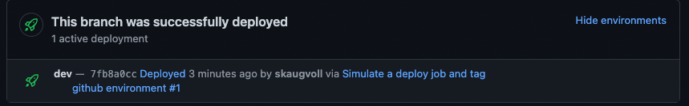
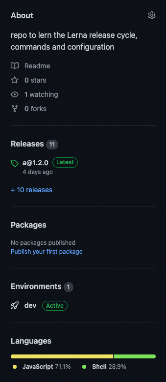
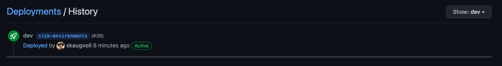
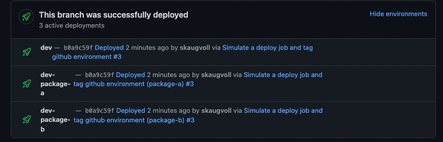
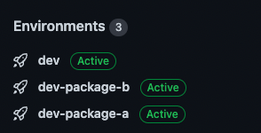
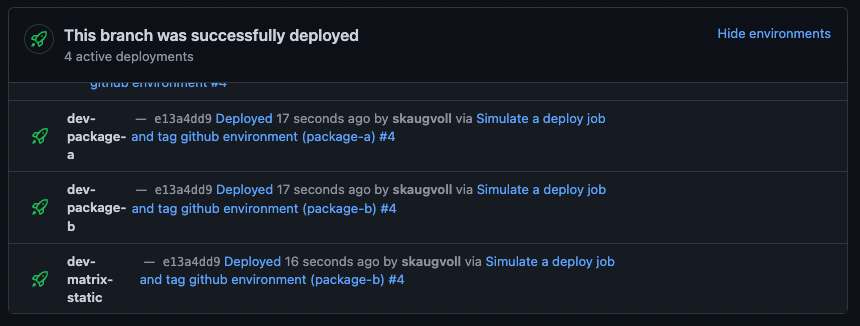
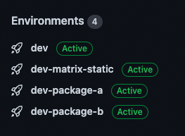
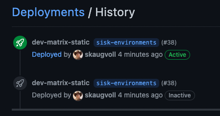

# Github Environments

When adding a workflow with a job that has `jobs.<job_id>.environment: x` there pops up a new tile on the pull_request that did the deploy job, and shows. `This branch was successfully | failed  deployed`
it states, `1 active deployent`
also links to `see environments`

There is also a new Tile in the right-menu on the front-page (<>code) of the repository

the Tile is clickable and takes you to a new page `Deployments/History`

## Giving undefined environment
This works, github creates the environment for you :smile:

## Jobs with Strategy.Matrix

### Matrix and dynamic environment name
This example is done using a matrix with package-a and package-b as value, and passing the matrix values as suffix to environment
Github creates the dev-${{matrix.package}} environment for us

It actually does all the deployments. this is equal to having one environment for each package. Which in turn would be to have just one environment dev.

Resulting on different environments on code page (repo frontpage)

###  When we deploy dont have a separate environment for package
We will use a matrix job with the same two matrix values as above (package-a, package-b), but they will deploy to the same environment dev-matrix-static

code page:

Deployments/history

as we can see it stacks all the deploy jobs in the history, so the last package deployed is marked as the last deployment

When I re-runned the workflow, the deployment that was suppose to be the next and marked as active, did in fact become marked as inactive. Found an issue/discussion that explains why. So the first job that deployed, is set as active, and the last one to terminate is marked inactive, and thus the environment tile is also marked as inactive. Not the best behaviour. There is talk about an setting option that deactivates auto_inactive, which would resolve this problem/behaviour 

> Seems like if we have two jobs running after each other the last executed overwrites the environment, and sets it as inactive
> https://github.com/actions/runner/issues/1001

# Conclusion
## Microservice projects, Deployes all packages at once
For multi-package / microservice projects that deployes all the packages together, we should use one static environment
and then have a separate job for marking the deployment as "deployed". Following the code page and or the deployment/history page, we can go to the pull_request and workflow that did the deploy job. Which gives us an indication of what changes was deployed. By using a post-job we dont add noise to the history for each package, but just add the wanted information

## Microservice projects, Deployes packages individually
Use one environment (dynamic example) that has <environment.stage>-<microservice-name>, then we can track all deployments (history) for each individual package